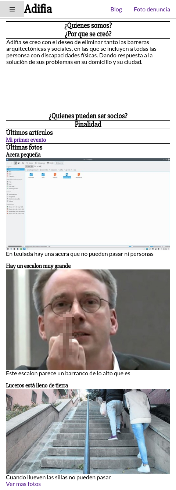

# Adifia (Propuesta página web)

> ## Tecnologias usadas
>
> * Nodejs con babel
> * Vuejs con axios y nuxt (cliente web) 
> * Expressjs (servidor) con mongodb (manda respuestas JSON)
> * Linux

## Conceptos de la web
La web principalmente es un portafolio que dispone creación de artículos y almacenamiento de fotos (para el foto denuncia), además de eso permite gestión de usuarios así que todos los socios van a poder participar en la asociación a través de la web.
## Es adaptativa
> Pantalla pequeña (movil)
>
> 

> Pantalla mediana (Tablet)
>
> 

> Pantalla larga (Portátil)
>
> 

[Comportamiento de la barra lateral](Capturas/aside.mp4)

## Lugares

Hay dos principales lugares en el sitio web donde se pueden estar:

| Blog                                                         | Foto denuncia                                                |
| ------------------------------------------------------------ | ------------------------------------------------------------ |
|  |  |

### Blog

Es un lugar donde se pueden ver, ojear, leer, y crear y modificar artículos y eventos, los eventos se hacen marcando una casilla en el formulario de creación del artículo

| Creación de un artículo                                      | Creación de un evento                                        |
| ------------------------------------------------------------ | ------------------------------------------------------------ |
|  |  |

Cuando se crea un artículo simplmente hay que poner el título del artículo y escribir en sí el artículo, si por ejemplo se va la luz mientras se está escribiendo el artículo **no se ha perdido** por que se guarda en el propio ordenador el artículo y cuando se vuelve a el se puede continuar con su escritura.

> Esto anterior no sucede si lo que se está haciendo es modificar un artículo existente

También se puede ver un artículo individual.

 ### Foto denuncia

En la web el termino foto se refiere a una foto que se subió al servidor que se le hizo a un escalón, o una barrera arquitectónica, este espacio se llama foto denuncia y todo el mundo puede participar.

El formulario para crear una foto se ve así.

Se puede ver que hay un cuadro para subir una foto, información de contacto, titulo y descripción, y un buscador de google maps para poder enviar la ubicación exacta del sitio donde está la barrera.

El email se pone automaticamente si hay una sesión iniciada, si no hay que ponerlo, esto es bueno para que en un futuro se pueda enviar un email a todas aquellas personas que su denuncia haya sido atendida.

### Otras zonas de la web

| Página de perfil                                             | Pagina acerca de adifia                                      | Página de registro                                           |
| ------------------------------------------------------------ | ------------------------------------------------------------ | ------------------------------------------------------------ |
|  |  |  |

